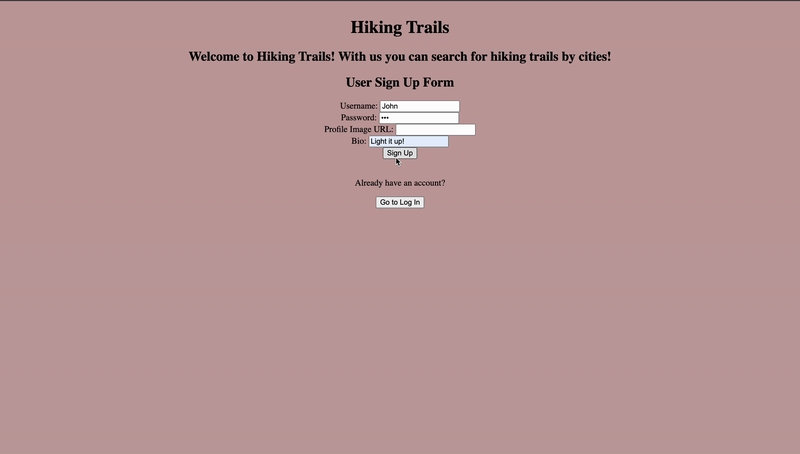
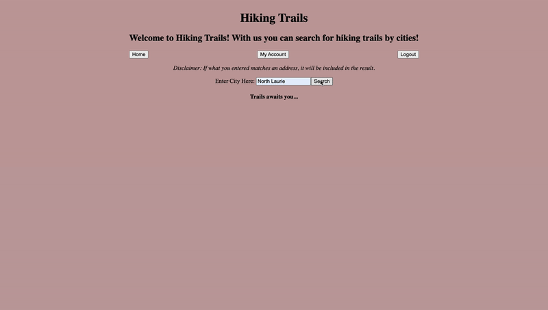
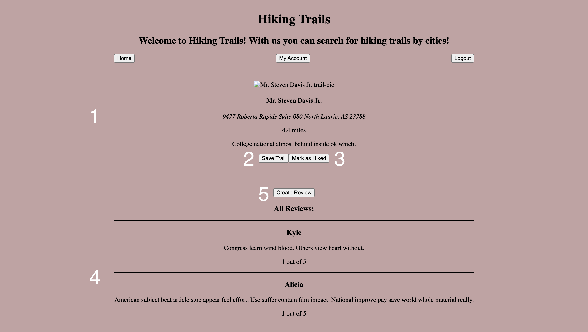
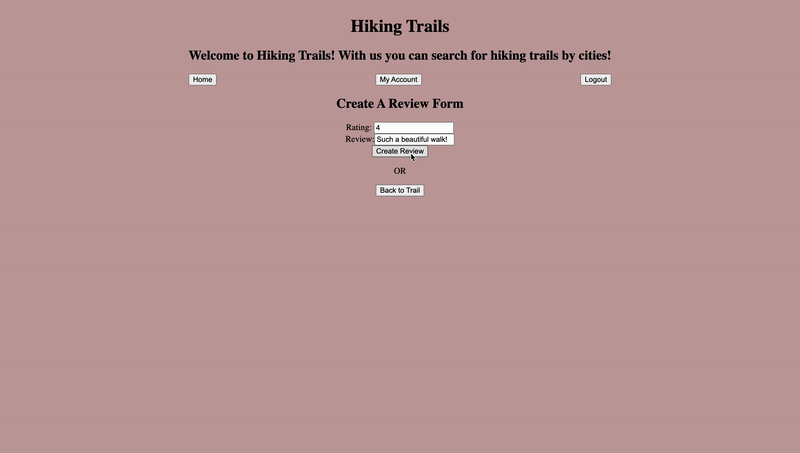
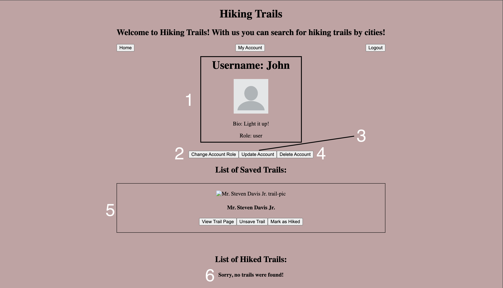
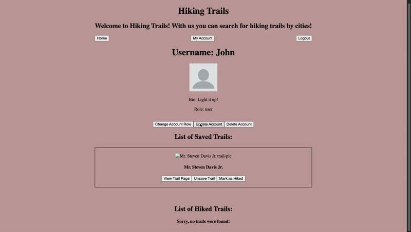
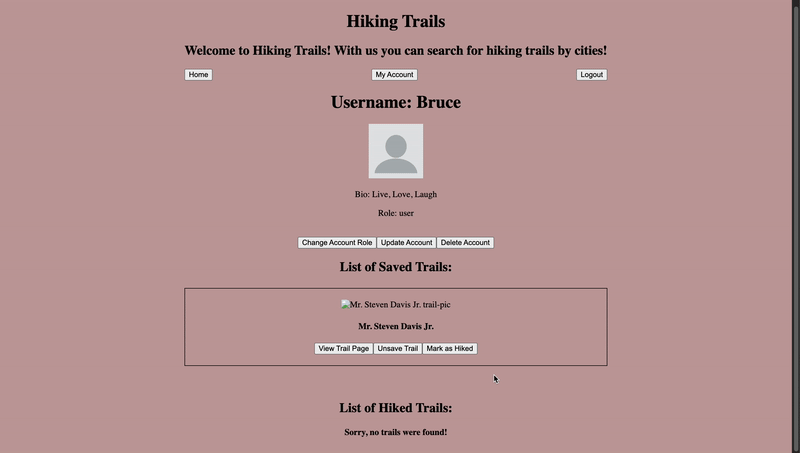

# Hiking Trails by City

This website was made for hiking enthusiasts. It allows users to search for hiking trails by entering a city name.

_Head down to Setup tab to get started!_

**Disclaimer: All trail and signup information you may see in the gifs below is for demonstration purposes only. It is not accurate!** 

## Usage

A user must make an account before getting access to the website features. Once logged in, a user can: 
* Search for hiking trails by typing in the name of a city
* Create their own review for a trail
* Read the reviews of a trail
* Save/Unsave a trail 
* Mark a trail as hiked/not hiked

A user can also view their account information which includes:
* Username
* Bio
* Account role
* List of saved trails
* list of hiked trails

A user also has the option of updating or deleting their account.

## Login / Signing Up

### Login

Logging is straightforward. Enter your credentials and click Log In.

### Signing Up

Only these fields are required to sign up:
* username
* password

The other fields are assigned a default value if left blank.

Additionally, all usernames are unique.



## Searching by City

Simply enter a city name, click search, and the results will be shown underneath.

If a city you entered is not in our database, you will be met with a message saying "Sorry, no trails were found!".



## Viewing Trail Page

After searching for a city and finding a trail that interests you, you can click the _View Trail Page_ button.

Doing so will allow you to:
1. View the trails information
2. Save the trail
3. Mark the trail as hiked
4. See a list of all the trail reviews
5. Create a review for the trail



## Creating a Review

To create a review press the _Create Review_ button. 

You will be redirected to a page. Once there, you can fill out the form and press the _Create Review_ button to create the review.



## User Page

After clicking the _My Account_ button, you will be redirected to the user page. 

On this page you will be able to:
1. View your account information
2. Change account role
3. Update account information
4. Delete account
5. See a list of saved trails
6. See a list of hiked trails



## Changing Account Role

This feature is exclusive to administrators.

## Updating Account Information

To update the account information:
1. click the _Update Account_ button
2. Enter your password to verify
3. Update the fields you wish to change
4. click _Update Account_



## Deleting Account

Deleting your account is straightforward. 

1. Click the _Delete Account_ button
2. Click the _YES_ button



## Getting Started

Fork and clone this repository into your local machine using the command prompt or terminal(Depending on your operating system). Then change your directory to the applications directory using the command "cd" followed by the name or path of the directory.


Having trouble doing this? Check out the article.
[How To Fork and Clone Repository](https://docs.github.com/en/pull-requests/collaborating-with-pull-requests/working-with-forks/fork-a-repo)

## Setup 

Once you have cloned this repository onto your machine, change your directory into the repositories directory.

### Backend

To download the dependencies for the backend server, run:

```console
pipenv install
pipenv shell
```

You can run your Flask API on [`localhost:5555`](http://localhost:5555) by
running:

```console
python server/app.py
```

Check that your server serves the default route `http://localhost:5555`. You
should see a web page with the heading "Project Server".

### Frontend

To download the dependencies for the frontend client, run:

```console
npm install --prefix client
```

You can run your React app on [`localhost:3000`](http://localhost:3000) by
running:

```sh
npm start --prefix client
```

Check that your the React client displays a default page
`http://localhost:3000`. You should see a web page with the heading "Hiking Trails".